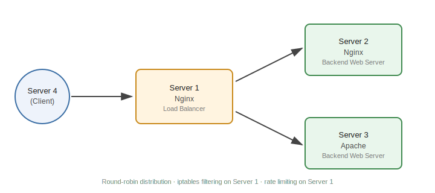

# Nginx Load Balancer on AWS EC2

A hands-on networking project built on AWS EC2 to understand how load balancing, traffic filtering, and rate limiting actually work at the infrastructure level — not just how to configure them, but why each piece sits where it does.

## Architecture

Four EC2 instances were used:

| Server | Role |
|---|---|
| Server 1 | Nginx configured as a load balancer |
| Server 2 | Nginx web server (backend) |
| Server 3 | Apache web server (backend) |
| Server 4 | Client machine sending requests |

**Traffic flow:** Client (Server 4) → Load Balancer (Server 1) → Backend (Server 2 or Server 3)

## What This Project Covers

### 1. Load Balancing

Nginx on Server 1 distributes incoming HTTP requests between Server 2 and Server 3 using Nginx's default **round-robin** method. Round-robin made sense here since both backend servers were of equal capacity — if they weren't, weighted round-robin (`weight=` parameter on each `server` line) would be the better choice, since it sends proportionally more traffic to the higher-capacity server.

Config: [`config/load_balancer.conf`](config/load_balancer.conf)

### 2. Manual & Automated IP Blocking

Suspicious or repeated client IPs were identified by inspecting Nginx access logs, then blocked using `iptables`.

Blocking was done at the **network layer** (iptables) rather than the application layer (Nginx's own `deny` directive). By the time a request reaches Nginx, the OS has already completed the TCP handshake and allocated connection resources. iptables can drop the packet at the kernel level before any of that happens, which is significantly more efficient against repeated or high-volume unwanted traffic.

Automation script: [`scripts/block_ip.sh`](scripts/block_ip.sh) — extracts unique IPs from the access log and blocks each one automatically. This is effectively a simplified, manual version of what tools like `fail2ban` automate in production.

### 3. Rate Limiting

Configured Nginx's `limit_req_zone` to cap each client IP to 5 requests per minute, preventing a single IP from overwhelming the backend servers with rapid repeated requests.

Config: [`config/rate_limiting.conf`](config/rate_limiting.conf)

## Setup Summary

**Server 1 (Load Balancer):** Installed Nginx, applied the upstream + proxy_pass config from `config/load_balancer.conf`, reloaded Nginx.

**Server 2 (Backend):** Installed Nginx, served a simple static response.

**Server 3 (Backend):** Installed Apache, served a simple static response.

**Verification:** Sent repeated requests to Server 1's public IP and confirmed responses alternated between Server 2 and Server 3, confirming round-robin distribution was working.

## Tech Stack

AWS EC2 · Nginx · Apache · iptables · Linux (Ubuntu)

## Notes / Learnings

- Default round-robin only makes sense when backend servers have equal capacity — mismatched servers need weighted distribution instead.
- Network-layer blocking (iptables) is more resource-efficient than application-layer blocking, since it drops traffic before the OS spends resources on it.
- Manually scripting log-based IP blocking helped clarify what production tools like `fail2ban` actually automate under the hood.